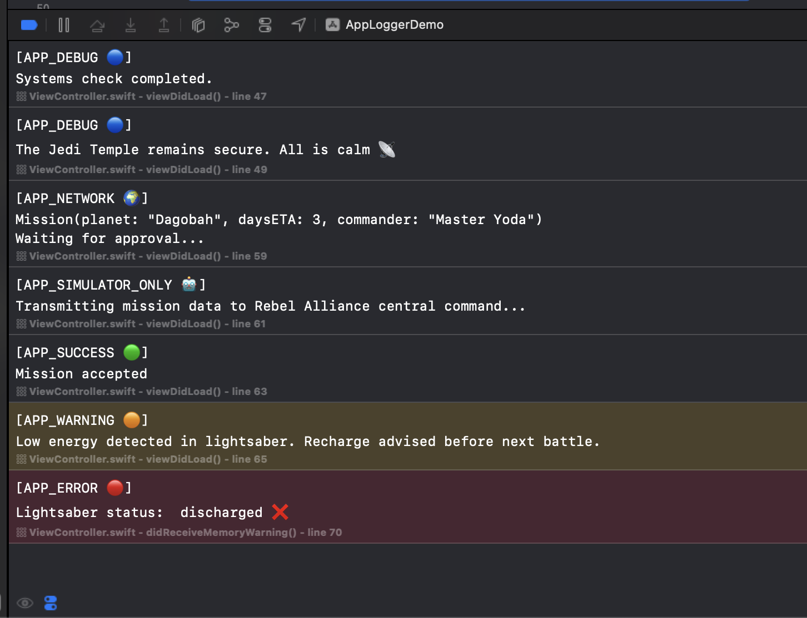
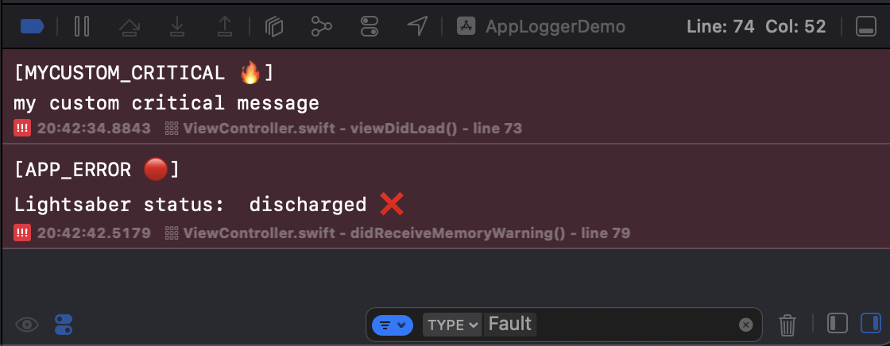
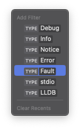
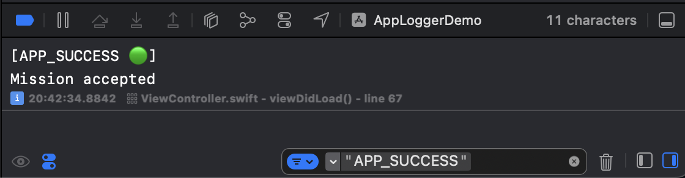
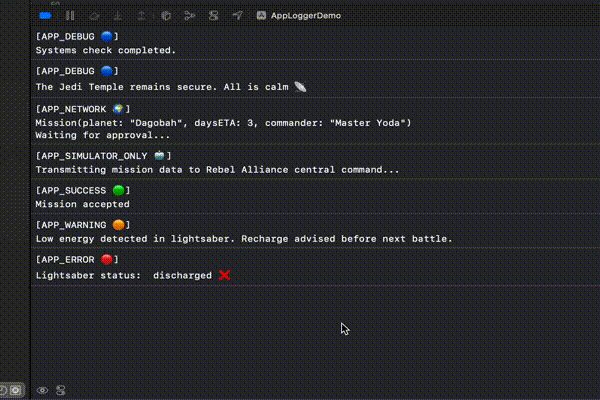
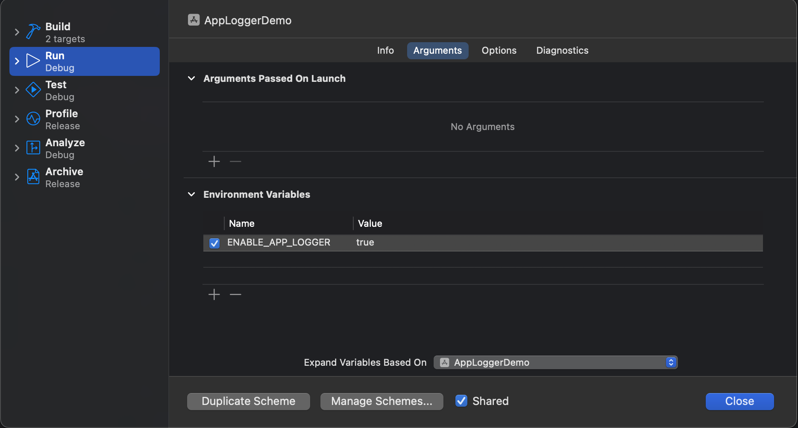
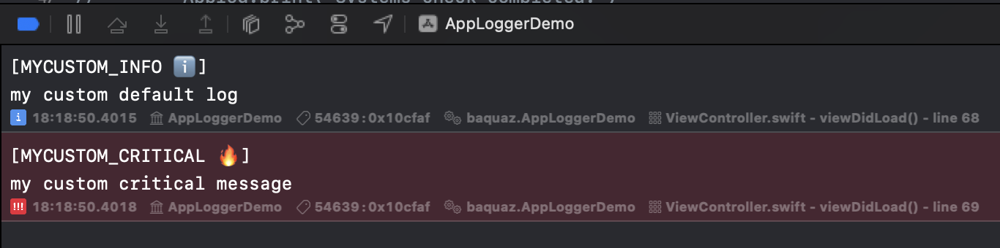

# AppLogger
Logging system, providing useful debug information for each print log.



#### Pros
- easy to use across the app
- easy type filtering
  
  

  

- easy custom filtering
  
   
  
- logs are printed only for debug mode, so in the production compiler stripes out the logger code
- plain arguments can be passed without being forced to use string interpolation such as `"\(myObject)"`
- supports interactive metadata
  
  

#### Cons
- _Location info_ (such as: line number, function and file) are passed to the system `Logger` as `category`, so it requires
  that each log creates new instance of the Logger. Potentially this could be a problem, however any performance issues were not encountered yet.
  
  For now _location info_ as category, brings interactivity to show/hide it at any point of time.
  Anyway, this can be easily refactored if a true purpose for categorization is needed (i.e., by moving _location info_ directly to the tag value and set optionally switchable via an extra environment variable).

# Installation SPM
Add Package Dependency... and paste the URL of this repo: `https://github.com/baquaz/AppLogger.git`

# Requirements
Platform | Minimum version
---------| --------------| 
iOS      |   **14**      | 
macOS    |   **11**      | 

Add Xcode Environment Variable: `ENABLE_APP_LOGGER` and set value `true` or `false` to handle the logs.



By default, if the variable is missing, the logs are disabled and there is a warning printed in the console.

# Usage
To make life easier start with defining global type alias.

```swift 
// AppDelegate.swift

import AppLogger

typealias Applog = AppLogger
```
This way we can add logs across entire project without having to import AppLogger for each file in which we are going to use them.

### Examples:
```swift
// simple log with default tag
Applog.print("Systems check completed.")

// simple log with explicit tag
Applog.print(tag: .debug, "The Jedi Temple remains secure. All is calm 📡")

struct Mission {
    let planet: String
    let daysETA: Int
    let commander: String
}

let mission = Mission(planet: "Dagobah", daysETA: 3, commander: "Master Yoda")

// log with multiple parameters and custom separator
Applog.print(tag: .network, 
             mission,
             "Waiting for approval...",
             separator: "\n")
```

# Customization


In case there is a need to use custom tags there are `AppLogType` and `LogStrategy` protocols to be used.

AppLogType defines custom log types.

```swift
enum MyLogType: AppLogType {
    case info, critical

    var label: String {
        switch self {
            case .info:
                "[MYCUSTOM_INFO ℹ️]"
            case .critical:
                "[MYCUSTOM_CRITICAL 🔥]"
        }
    }
}
```
Log Strategy defines how to print each log type
```swift
import os

struct MyCustomLogStrategy: LogStrategy {
    var defaultLogType: AppLogType = MyLogType.info
    
    func log(message: String, tag: any AppLogType, category: String) {
        let logger = Logger(subsystem: Bundle.main.bundleIdentifier ?? "--", category: category)
        switch tag {
            case let tag as MyLogType:
                switch tag {
                    case .info:
                        logger.info("\(message)")
                    case .critical:
                        logger.critical("\(message)")
                }
            default:
                logger.log("\(message)")
        }
    }
}
```

### Usage
```swift
// set custom log strategy first
Applog.setCustomLogStrategy(MyCustomLogStrategy())

Applog.printCustom("my custom default log")
Applog.printCustom(tag: MyLogType.critical, "my custom critical message")
```

# References
Many claps 👏 to the author of this post:

https://medium.com/@alessandromanilii/custom-swift-logger-in-xcode15-19da40a058a5
